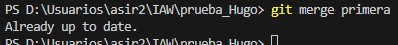

# Ejercicio 3

### Crea una rama que se llame primera en un repositorio local, y ejecuta la instrucción necesaria para comprobar que se ha creado.

### Crea un nuevo fichero en esta rama y fusiónalo con la principal. ¿Se ha producido conflicto? Razona la respuesta.

### Borra la rama primera

### Crea una rama que se llame segunda, y modifica un fichero en ella para producir un conflicto al unirlo a la rama principal. Entrega el contenido del fichero donde se ha producido el conflicto.

